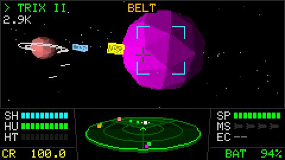
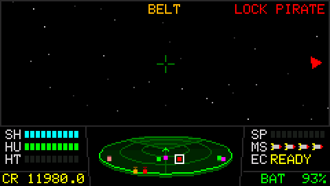
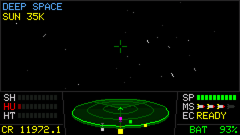
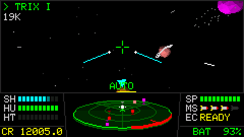
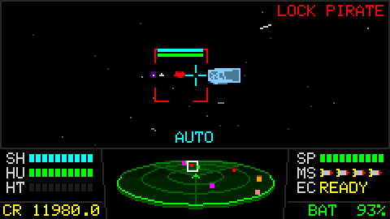
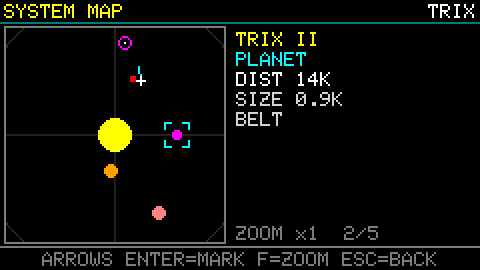
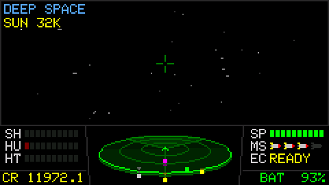

# Hazke

A space trading and combat game for the M5Stack Cardputer. Fly between
sixteen star systems, trade cargo, take jobs from planets and fight
pirates, all on a 240×135 screen.



**[Download v1.3](https://github.com/therezor/hazke/releases/download/v1.3.0/hazke-v1.3.0-cardputer.bin)**
· [All releases](https://github.com/therezor/hazke/releases)

Inspired by *Elite*, *Parkan: Imperial Chronicles* and *Galaxy on Fire 2*.
All code and art are original.

## Install

Pick Hazke from your launcher's app list, or flash the firmware yourself.

**Prebuilt firmware.** Download `hazke-v1.3.0-cardputer.bin` from the
[latest release](https://github.com/therezor/hazke/releases/latest) and
flash it with M5Burner or esptool:

```
esptool.py --chip esp32s3 write_flash 0x0 hazke-v1.3.0-cardputer.bin
```

This full image also clears the saves in internal flash. To keep them
when upgrading a Cardputer that already runs Hazke, flash only the game
from `hazke-v1.3.0-app.bin`:

```
esptool.py --chip esp32s3 write_flash 0x10000 hazke-v1.3.0-app.bin
```

Or copy your slots to the SD card first (save menu, `COPY`).

**From source.** Install the `M5Cardputer` library in the Arduino IDE
(it pulls in `M5Unified` and `M5GFX`), open `hazke.ino`, pick the
`M5Cardputer` board and upload. With arduino-cli:

```
arduino-cli compile --fqbn esp32:esp32:m5stack_cardputer --upload -p <port> .
```

## New in v1.3

All clips were recorded on a Cardputer.

<table>
<tr>
<td width="50%"><br>
<b>Autolock.</b> A 300 CR module. Press <code>F</code> and the ship turns onto your target, then holds it. Pitch or yaw keys override it.</td>
<td width="50%"><br>
<b>3D scanner.</b> The scanner is a tilted disk. Each contact stands on a stalk that shows whether it's above or below you.</td>
</tr>
<tr>
<td><br>
<b>Hit arcs.</b> A red arc on the scanner rim points at whoever just hit you, and follows them as you turn.</td>
<td><br>
<b>Rockets and a new cockpit.</b> Missiles fly with an exhaust trail. The gauges are segmented and the rack shows each missile.</td>
</tr>
<tr>
<td><br>
<b>System map.</b> Bigger, with an x2 zoom on <code>F</code>. Hostile ships show red and friendly ones green, here and on the scanner.</td>
<td><br>
<b>Open space.</b> Systems have no walls. Past 30K from the sun you are in deep space, and the HUD shows how far home is.</td>
</tr>
</table>

Also new: every sound effect is rebuilt and mixed on separate channels,
with a volume setting (off, low, medium, high) on the title and pause
menus. The screen updates are double-buffered, so flight runs smoother.

## How to play

You start next to a jump gate with 100 credits and an empty hold.

- **Trade.** Buy goods where they're cheap and sell where they're scarce.
  Farm worlds sell food cheap and pay well for machinery, and industrial
  worlds do the opposite. Three goods are illegal and get scarcer under
  stable governments.
- **Take jobs.** Land on a planet and open the job board. Jobs include
  hunting pirates, delivering cargo, fetching goods the planet can't
  buy locally, visiting a planet and carrying a courier package. You get paid when you return to the planet that gave
  you the job (couriers pay on arrival).
- **Fight.** Pirates attack on sight. Below 50% hull a ship's engines
  drop to half power, and below 25% its weapons stop working. Fly up to
  a beaten ship and press `H` to take its cargo.
- **Travel.** Fly into a jump gate to open the galactic chart. Jumps go
  only to systems linked by a gate and cost 10 CR per light year.
- **Land.** Fly into a planet. Landing opens the market, the equipment
  shop, the job board and the save menu.

Your standing with four factions goes up and down with kills, trades
and jobs. Patrols turn on you if a faction dislikes you enough, and
prices shift by up to 20% either way. Kills earn a rank, from Harmless
to Deadly.

Shields recharge slowly while they hold. Once a shield drops to zero it
stays down until you pay for a repair. Hull damage only comes off at a
repair shop.

### Equipment

| Item | Price | Effect |
|------|-------|--------|
| Repair hull | 10 CR per 10% | Fixes hull damage |
| Repair shield | 100 CR | Brings a downed shield back |
| Missile | 30 CR | Homing missile, up to 4 |
| ECM | 600 CR | Blows up nearby missiles (`Q`) |
| Autolock | 300 CR | Turns the ship onto your target (`F`) |
| Large hold | 400 CR | Cargo space from 20 t to 35 t |
| Beam laser | 1000 CR | More damage and range |
| Military laser | 6000 CR | The best laser, needs the beam laser first |

## Controls

The arrow keys are the `;` `,` `.` `/` keys, marked with arrows on the
Cardputer.

| Key | Action |
|-----|--------|
| `↑` `↓` | Pitch |
| `←` `→` | Roll |
| `L` `'` | Yaw |
| `E` / `S` | Speed up / slow down |
| `W` or `Space` | Fire laser |
| `R` | Cycle missile lock through ships ahead |
| `A` | Fire a missile |
| `Q` | ECM |
| `F` | Autolock, or zoom on the system map |
| `Tab` | Next target (ships and places) |
| `H` | Hail or loot a nearby ship |
| `M` | System map |
| `Enter` | Confirm |
| `` ` `` | Back / pause |
| `Ctrl` + `Space` | Screenshot to the SD card |

## Saving

Save from the landing menu of any planet, and load from the title
screen. There are five slots in internal flash and five on the microSD
card, and a slot can be copied between the two. Saves from older
versions load in newer ones. A save made by a newer version shows as
`NEWER VERSION` and is left alone.

v1.3 changed the save format. v1.2 saves load fine, but once you save
a slot in v1.3, v1.2 can't read it.

## Serial console

With the Cardputer connected over USB, a serial terminal at 115200 baud
accepts these commands:

| Command | What it does |
|---------|--------------|
| `status` | Prints the commander, screen, credits and system |
| `credits <CR>` | Sets your credits |
| `save [1-5] [sd\|int]` | Saves to a slot |
| `cap on` / `cap off` | Pauses the game so it only advances on `step` / `rec` |
| `keys <chars>` | Holds those keys down (`T` is Tab, `N` is Enter) |
| `step <n>` / `rec <n>` | Runs `n` frames of 1/25 s each; `rec` also sends each frame |
| `shot` | Sends the current frame |

Frames go out as RGB565, run-length packed (`Capture.h` describes the
format). `tools/capture.py` sends these commands from a computer and
saves the frames as PNGs. The clips in this README were recorded with it.

## Code

The game is a set of single-header modules included from `hazke.ino`,
which runs the screen state machine and the frame loop.

```
hazke.ino           state machine, frame loop, serial console
Config.h            version, screen layout, build switches
Input.h             keyboard polling (+ keys held by the console)
Capture.h           frame capture over serial
GameState.h         credits, cargo, ship, factions
Galaxy.h            the 16 systems and their gate links
SolarSystem.h       planets, belts and the gate in each system
SystemFlight.h      3D flight, camera, autolock, landing
NPCShip.h           traders, pirates and patrols
Combat.h            lasers and damage
Missile.h           homing missiles and ECM
Radar.h             3D scanner and hit arcs
Cockpit.h           gauges, missile rack, footer
Raster.h            clipped line and triangle drawing
Ship3D.h            ship models
Sky.h               distant stars and space dust
Rocket.h            missile art
Starfield.h         hyperspace tunnel
Particles.h         explosions and debris
Audio.h             sound synthesis and mixing
Market.h            prices and stock
Quest.h             jobs
Faction.h           faction standing
Rank.h              combat rank
Hyperspace.h        jump cost and range
SaveFormat.h        save layout, checksum, upgrades between versions
SaveStore.h         save slots on flash and SD
SDCard.h            shared microSD setup
Screenshot.h        Ctrl+Space screenshots
*Screen.h, MenuUI.h, PauseMenu.h   menus and screens
```

## License

Original work. No code or art is taken from the games that inspired it.
