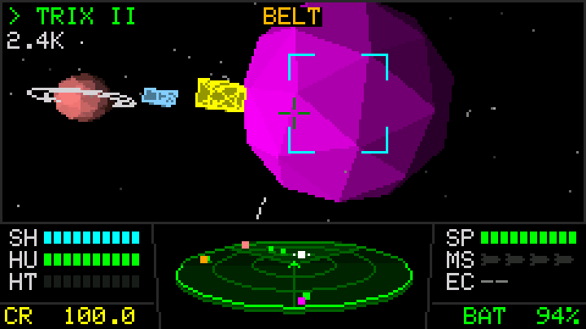
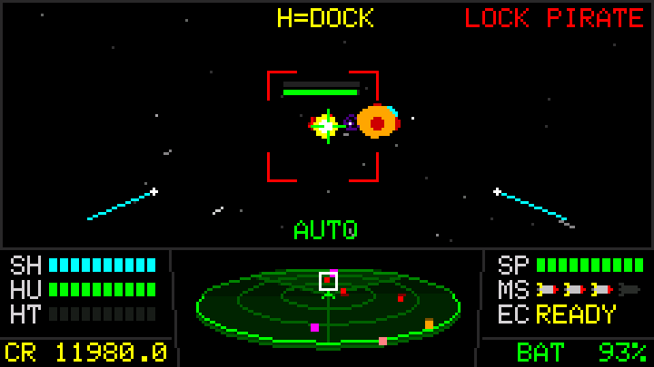
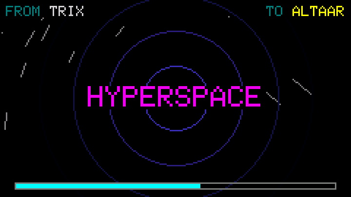
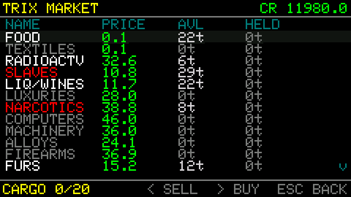
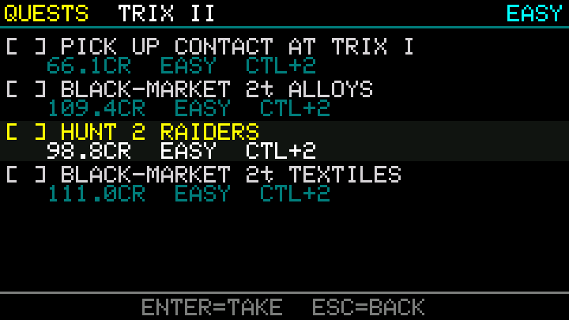
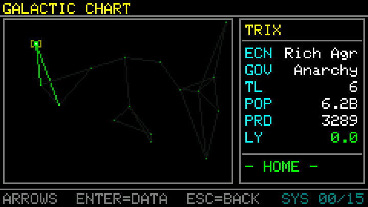
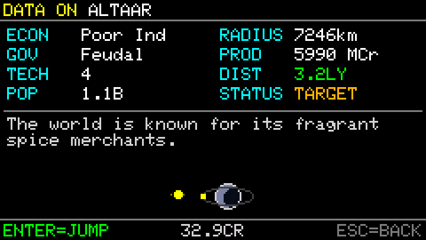
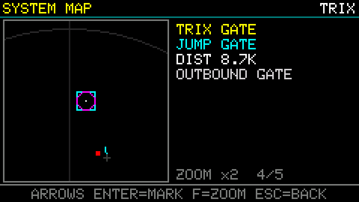
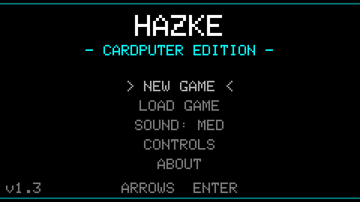

<p align="center">
  
</p>

<h1 align="center">Hazke</h1>

<p align="center">
  <b>A space trading and combat game for the M5Stack Cardputer.</b><br>
  Fly between sixteen star systems, trade cargo, take jobs from planets and fight pirates.<br>
  The whole game runs on the device, with no phone, account or internet.
</p>

<p align="center">
  <a href="https://github.com/therezor/hazke/releases/latest"><b>⬇️ Download firmware</b></a> ·
  <a href="#-watch-it-play"><b>▶️ Watch it play</b></a> ·
  <a href="#-new-in-v13"><b>✨ New in v1.3</b></a> ·
  <a href="#-try-it-in-3-steps"><b>🚀 Try it</b></a> ·
  <a href="#-controls"><b>🎮 Controls</b></a>
</p>

---

## 🎬 Watch it play

<p align="center">
  <a href="https://github.com/therezor/hazke/releases/download/v1.3.0/hazke-v1.3-demo.mp4"></a>
  <a href="https://github.com/therezor/hazke/releases/download/v1.3.0/hazke-v1.3-demo.mp4"></a>
  <a href="https://github.com/therezor/hazke/releases/download/v1.3.0/hazke-v1.3-demo.mp4"></a>
</p>

<p align="center"><a href="https://github.com/therezor/hazke/releases/download/v1.3.0/hazke-v1.3-demo.mp4"><b>Download the 41-second demo video</b></a>, captured from the Cardputer's own screen at 25 frames per second.</p>

In the demo:

1. The ship flies through the asteroid belt of TRIX II and lands. The landing menu opens.
2. Autolock turns the nose onto a pirate. A missile hits it and the lasers finish it, for a 25 CR bounty.
3. The ship flies into the TRIX jump gate, picks ALTAAR on the galactic chart and jumps.
4. Autolock again, then the 3D scanner while the ship pitches over in deep space.
5. A red hit arc on the scanner rim follows an attacker as the ship turns.
6. A missile launch, a hit, and a laser kill.
7. The system map zooms in on the gate and marks a pirate as hostile.
8. The HUD shows the distance to the sun in deep space, then "ENTERING ALTAAR" on the way back in.

## 🌌 What it is

Hazke is a space sim in the style of *Elite*, built for a 240×135 screen and a 56-key keyboard.
You fly in full 3D with pitch, roll and yaw. Planets are shaded polygons with rings, moons and
asteroid belts. Prices move with each system's economy and government and with your reputation,
and pirates, traders and patrols fly their own routes.

The game draws every frame in code on the Cardputer's ESP32-S3 and loads no image files. It
generates all sixteen systems from one seed, so the galaxy is the same on every device.

## 📊 By the numbers

| | Hazke |
|---|---|
| 🌌 **Galaxy** | 16 star systems, linked by jump gates |
| 🪐 **Each system** | a sun, one to three planets, asteroid belts, and a jump gate |
| 💰 **Market** | 17 goods, 3 of them illegal |
| ⚔️ **Weapons** | 3 laser grades, up to 4 homing missiles, an ECM, autolock |
| 📜 **Jobs** | 5 kinds: hunt pirates, deliver, fetch, visit, courier |
| 🏳️ **Factions** | 4, each with a standing from -100 to +100 |
| 🎖️ **Ranks** | 7, from Harmless to Deadly |
| 🖥️ **Frame budget** | 16 ms, about 60 frames per second |
| 💾 **Saves** | 5 slots in flash and 5 on the SD card, about 100 bytes each |
| 📡 **Internet** | Not needed |

## ✨ New in v1.3

<table>
<tr>
<td width="50%"><br>
<b>🎯 Autolock.</b> The module costs 300 CR. Press <code>F</code> and the ship turns onto your target and keeps pointing at it. Holding a pitch or yaw key overrides it.</td>
<td width="50%"><br>
<b>📡 3D scanner.</b> The scanner is a tilted disk. A line from each contact to the disk shows whether the contact is above or below you.</td>
</tr>
<tr>
<td><br>
<b>💥 Hit arcs.</b> A red arc on the scanner rim points at whoever just hit you, and follows them as you turn.</td>
<td><br>
<b>🚀 Rockets and a new cockpit.</b> Missiles look like rockets and leave an exhaust trail. The gauges have segments, and the rack draws each missile you carry.</td>
</tr>
<tr>
<td><br>
<b>🗺️ System map.</b> The map is bigger, and <code>F</code> zooms in 2x. Hostile ships show red and friendly ones green, on the map and on the scanner.</td>
<td><br>
<b>🌠 Open space.</b> Systems have no walls. Past 30K from the sun you are in deep space, and the HUD shows your distance to the sun.</td>
</tr>
</table>

🔊 Every sound effect is new too. Effects play on separate channels, so one no longer cuts off
another, and the title and pause menus have a volume setting with four levels. The display is
double-buffered now, so the game draws the next frame while the screen shows the last one.

## 📸 Screens

<p align="center">
  
  
  
</p>
<p align="center">
  
  
  
</p>

## 🧸 What it has and doesn't

| 👍 Has | 👎 Doesn't have (yet) |
|---|---|
| Free 3D flight with pitch, roll and yaw | Music. There are sound effects only. |
| Trading, bounties, and looting beaten ships | Jobs that span systems. Every job stays in one system. |
| Lasers, missiles, ECM and autolock | Other ships to buy. You fly one ship and upgrade it. |
| A reputation with four factions that changes prices and patrols | Saving in flight. You save while landed on a planet. |

## 🚀 Try it in 3 steps

1. **Get a Cardputer.** Hazke runs on the [M5Stack Cardputer](https://docs.m5stack.com/en/core/Cardputer).
2. **Flash it.** Pick Hazke in your launcher's app list, or download `hazke-v1.3.0-cardputer.bin` from
   [Releases](https://github.com/therezor/hazke/releases/latest) and write it at address `0x0` with the
   [ESP web flasher](https://espressif.github.io/esptool-js/), M5Burner or
   `esptool.py --chip esp32s3 write_flash 0x0 hazke-v1.3.0-cardputer.bin`.
3. **Choose NEW GAME and type a name.** You start next to a jump gate with 100 credits. Fly into a
   planet to land and trade, and fly into a jump gate to travel.

> [!NOTE]
> The full image clears the save slots in internal flash. To upgrade and keep them, write only the
> game with `esptool.py --chip esp32s3 write_flash 0x10000 hazke-v1.3.0-app.bin`, or copy your slots
> to the SD card first with `COPY` in the save menu.

To build it yourself, install the `M5Cardputer` library in the Arduino IDE, open `hazke.ino`, pick
the `M5Cardputer` board and upload. With arduino-cli:

```sh
arduino-cli compile --fqbn esp32:esp32:m5stack_cardputer --upload -p <port> .
```

## 🎮 Controls

The arrow keys are `;` `,` `.` `/`, marked with arrows on the Cardputer.

| Key | What it does |
|---|---|
| `↑` `↓` | pitch |
| `←` `→` | roll |
| `L` `'` | yaw |
| `E` / `S` | speed up / slow down |
| `W` or `Space` | fire laser |
| `R` / `A` | cycle missile lock through ships ahead / fire a missile |
| `Q` | ECM |
| `F` | autolock, or zoom on the system map |
| `Tab` | next target, ships and places |
| `H` | hail or loot a nearby ship |
| `M` | system map |
| `Enter` | confirm |
| `` ` `` | back / pause |
| `Ctrl` + `Space` | screenshot to the SD card |

## 🧭 How to play

- **Trade.** Buy goods where they're cheap and sell them where they're scarce. Farm worlds sell food
  cheap and pay well for machinery, and industrial worlds do the opposite. Three goods are illegal,
  and stable governments stock less of them.
- **Take jobs.** Land on a planet and open the job board. Most jobs pay when you return to the planet
  that offered them. Courier jobs pay on arrival.
- **Fight.** Pirates attack on sight. Below 50% hull a ship's engines drop to half power, and below 25%
  its weapons stop working. Fly up to a beaten ship and press `H` to take its cargo.
- **Travel.** Fly into a jump gate to open the galactic chart. You can jump only to systems linked by a
  gate, and a jump costs 10 CR per light year.

Kills, trades and jobs raise or lower your standing with four factions. If your standing with a
faction drops below -30, its patrols attack you. Standing also moves prices by up to 20% either way.

A shield recharges fully in about 37 seconds as long as it stays above zero. Once it hits zero it stays
down until you pay for a repair. Only the equipment shop can repair hull damage.

| Equipment | Price | What it does |
|---|---|---|
| Repair hull | 10 CR per 10% | fixes hull damage |
| Repair shield | 100 CR | brings a downed shield back |
| Missile | 30 CR | a homing missile, up to 4 |
| ECM | 600 CR | `Q` blows up nearby missiles |
| Autolock | 300 CR | `F` turns the ship onto your target |
| Large hold | 400 CR | cargo space from 20 t to 35 t |
| Beam laser | 1000 CR | more damage and range |
| Military laser | 6000 CR | the best laser, needs the beam laser first |

## 💾 Saving

Save from the landing menu of any planet, and load from the title screen. There are five slots in
internal flash and five on the microSD card, and `COPY` in the save menu copies a slot from one to the
other. Saves from older versions load in newer ones. A save made by a newer version shows as
`NEWER VERSION`, and the game leaves it alone.

v1.3 changed the save format. v1.2 saves load fine, but once you save a slot in v1.3, v1.2 can't read it.

## 🔧 Under the hood

1. **One header per module.** `hazke.ino` runs the screen state machine and the frame loop. Each
   system and screen lives in its own `.h` file, and the Arduino IDE is the only build tool.
2. **The galaxy comes from one seed.** The game regenerates systems, gate links, planets and prices
   from the seed when it needs them, so a save only stores your own state.
3. **3D in software.** Planets are shaded icospheres and ships are filled outlines with edges. `Raster.h`
   clips every line and triangle to the view first. A shape far off-screen used to take about 4 ms to
   draw, and now takes 0.02 ms.
4. **Two frame buffers.** The game draws into one while DMA sends the other to the screen.
5. **Sound is synthesized at boot.** `Audio.h` builds every effect from oscillators and filtered noise
   into an 8-bit sample bank, and the speaker task mixes them on separate channels.
6. **Saves carry a version and a checksum.** When the format changes, `SaveFormat.h` upgrades older
   saves step by step as they load.

<details>
<summary><b>🖥️ Serial console and frame capture</b></summary>

With the Cardputer connected over USB, a serial terminal at 115200 baud accepts these commands:

| Command | What it does |
|---|---|
| `status` | prints the commander, screen, credits and system |
| `credits <CR>` | sets your credits |
| `save [1-5] [sd\|int]` | saves to a slot |
| `cap on` / `cap off` | pauses the game so it only advances on `step` / `rec` |
| `keys <chars>` | holds those keys down (`T` is Tab, `N` is Enter) |
| `step <n>` / `rec <n>` | runs `n` frames of 1/25 s each; `rec` also sends each frame |
| `shot` | sends the current frame |

The firmware sends frames as run-length packed RGB565, and `Capture.h` describes the format.
`tools/capture.py` sends these commands from a computer and saves the frames as PNGs. Every clip and
screenshot in this README comes from it.

```sh
python3 tools/capture.py autolock 'T*1' 'f*1r' '_*80r'   # mark a target, press F, record 80 frames
```

</details>

<details>
<summary><b>🗂️ Code map</b></summary>

```text
hazke.ino           state machine, frame loop, serial console
Config.h            version, screen layout, build switches
Input.h             keyboard polling and keys held by the console
Capture.h           frame capture over serial
GameState.h         credits, cargo, ship, factions
Galaxy.h            the 16 systems and their gate links
SolarSystem.h       planets, belts and the gate in each system
SystemFlight.h      3D flight, camera, autolock, landing
NPCShip.h           traders, pirates and patrols
Combat.h            lasers and damage
Missile.h           homing missiles and ECM
Radar.h             3D scanner and hit arcs
Cockpit.h           gauges, missile rack, footer
Raster.h            clipped line and triangle drawing
Ship3D.h            ship models
Sky.h               distant stars and space dust
Rocket.h            missile art
Starfield.h         hyperspace tunnel
Particles.h         explosions and debris
Audio.h             sound synthesis and mixing
Market.h            prices and stock
Quest.h             jobs
Faction.h           faction standing
Rank.h              combat rank
Hyperspace.h        jump cost and range
SaveFormat.h        save layout, checksum, upgrades between versions
SaveStore.h         save slots on flash and SD
SDCard.h            shared microSD setup
Screenshot.h        Ctrl+Space screenshots
*Screen.h, MenuUI.h, PauseMenu.h   menus and screens
```

</details>

<details>
<summary><b>📜 Changelog</b></summary>

- **v1.3**, a new cockpit and open space
  - Autolock module, 3D scanner with hit arcs, segmented gauges and rocket missiles.
  - A bigger system map with zoom, and red or green markers for hostile and friendly ships.
  - No walls at the edge of a system, and a deep-space HUD past 30K from the sun.
  - All sound effects rebuilt, with a volume setting. Double-buffered display.
  - Serial console frame capture. Save format v2.
- **v1.2**, saves
  - Five save slots in flash and five on the SD card, with copying between the two.
  - A name for your commander, and yaw on `L` and `'`.
- **v1.1**, controls
  - `Tab` cycles through ships as well as places. Docking prompt fixes. One back key, `` ` ``.
- **v1.0**, the first release
  - Sixteen star systems, 3D flight, a 17-good market, lasers, missiles and ECM, job boards, four
    factions and seven ranks.

</details>

## 📄 License

Original work. Hazke uses no code or art from *Elite*, *Parkan: Imperial Chronicles* or
*Galaxy on Fire 2*, the games that inspired it. Made by REZOR ([@therezor](https://github.com/therezor)).
